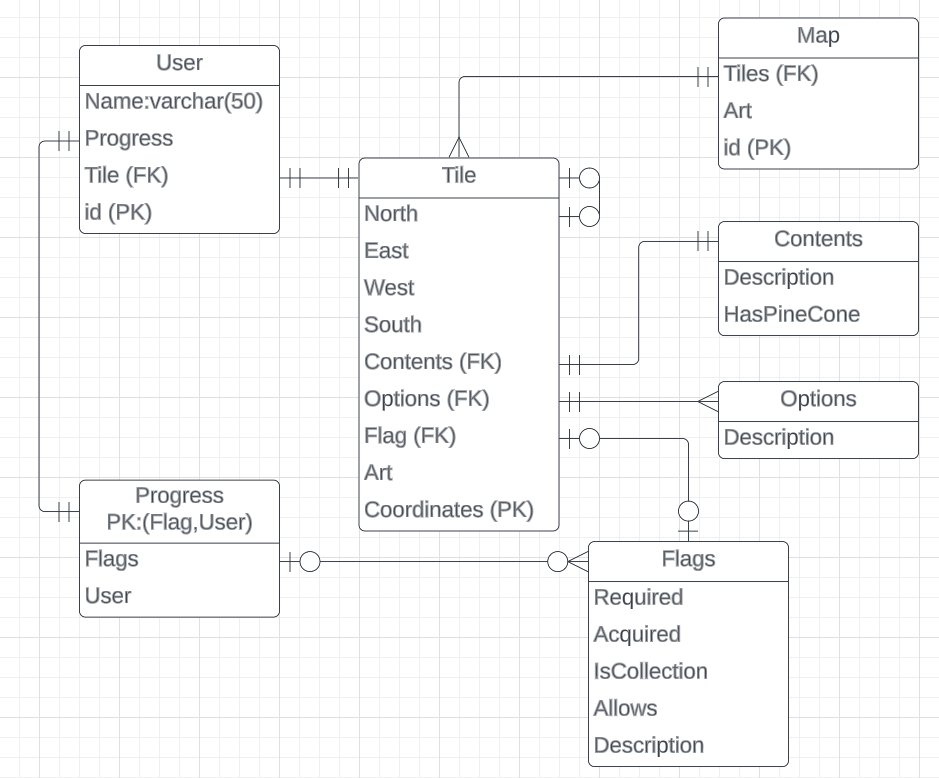

# Pine_Cones, the CLI Text Adventure

## Demo

Check out a short demo video on [Youtube.com](https://www.youtube.com/watch?v=Kup5f_HydWo)

## ERD



## User Stories

- as a user, I want to be greeted with information about the game when I start up the CLI, so there should be
a greeting interface

- as a user, I want to be able to move through the world, so there should be options to go N,S,E,W

- as a user, I want to have a progression mechanic, so there should be pine cones hidden throughout the map

- as a user, I want to be able to look at the game world, so there should be an option to
view the map from the greeting interface

- as a user, I want to be able to beat the game, so there should be an unfolding progression
system based on pine cones collected **MVP FIRST THEN STRETCH**

**STRETCH**
- as a user, I want to look at some cool ASCII art, so there should be a couple cool things to run into
as well as greeting/exit art

- as a user, I want to look at play stats, i.e. time taken, tiles travelled, items collected

**DOUBLE STRETCH**
- as a user, I want to be able to save my progress under a username and come back to it later

**AFTER MVP REPEAT STRETCH**
- as a user, I want the game to unfold and get less... mundane as it goes

***
## File Structure
```console
.
├── Dependencies
│   └── Phase3ERD.png
├── Pipfile
├── Pipfile.lock
├── README.md
└── lib
    ├── cli.py
    ├── db
    │   ├── alembic.ini
    │   ├── migrations
    │   │   ...
    │   ├── models.py
    │   ├── pine_cones.db
    │   └── seed.py
    ├── debug.py
    └── helpers
        ...
```
***

## Installing Dependencies and entering shell

Run in console: 
```console
$ pipenv install
$ pipenv shell
```
***

## Map

```console
┌─────┬─────┬─────┬─────┬─────┐
|     |     |     |     |     |
|─────┼─────┼─────┼─────┼─────|
|     |     |  TT |     |     |
|─────┼─────┼─────┼─────┼─────|
|  O  |  S  |  BT |  H  |  B  |
|─────┼─────┼─────┼─────┼─────|
|     |  P  |  F  |     |     |
|─────┼─────┼─────┼─────┼─────|
|     |     |     |     |     |
└─────┴─────┴─────┴─────┴─────┘
```

## Resources

- [Setting up a respository - Atlassian](https://www.atlassian.com/git/tutorials/setting-up-a-repository)
- [Create a repo- GitHub Docs](https://docs.github.com/en/get-started/quickstart/create-a-repo)
- [Markdown Cheat Sheet](https://www.markdownguide.org/cheat-sheet/)
